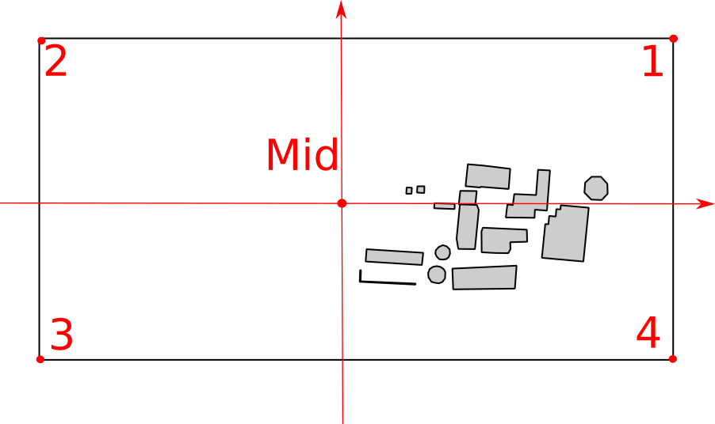

# README: map_langsenkamp

## Repository Structure

map_langsenkamp_v4.png

map_langsenkamp_v4.world

map_langsenkamp_v4.yaml

## Overview

Frame coordinates corespond to quadrants in coordinate system with the origin in the middle of the map.: 1: top right; 2: top left; 3: buttom left; 4: buttom right. The Coordinates describe the outer most position of the black frame. 

Type                | Value   
---                 | ---   
North               | $` 5797130.5030`$
East                | $` 442531.6955 `$
South               | $` 5796854.5382`$
West                | $` 442006.6057 `$
scale               | $` 1:5000   `$
Resolution          | $`1000 dpi`$
Image width         | $`4125 px`$
Image height        | $`2167 px`$
Size of map         | $`tbd`$
Pixel resolution    | $`tbd`$
Area covered        | $`tbd`$  
Number of Buildings | $`15`$

<!--- 
FRAME Mid point     | $`442269.164532297,5796992.52031764`$
Frame coordinates 1 | $`442528.622940966,5797124.43188242`$
Frame coordinates 2 | $`442009.706123629,5797124.43188242`$
Frame coordinates 3 | $`442009.706123629,5796860.60875286`$
Frame coordinates 4 | $`442528.622940966,5796860.60875286`$
--->

measured in ggis (measurement tool):
519,103 m
263,918 m

calculated from distance coordinates:
518,916817337 m
263,82312956 m

## Map

The map is only for name reference
